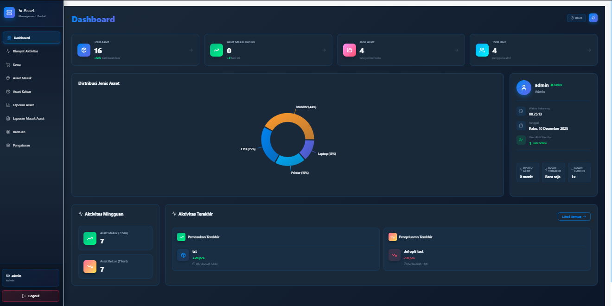
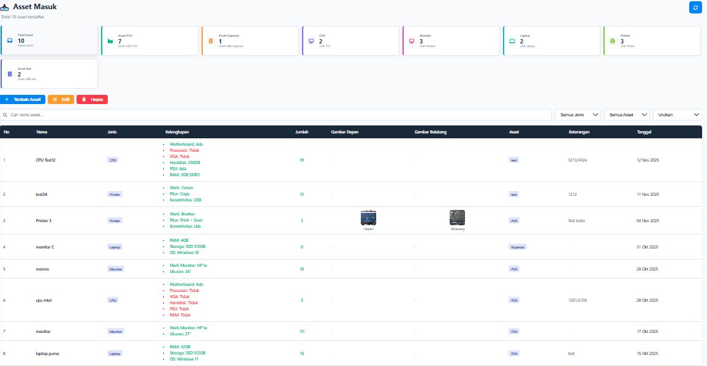
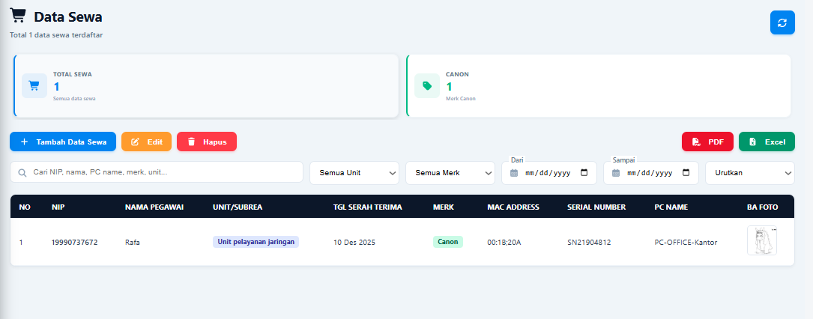
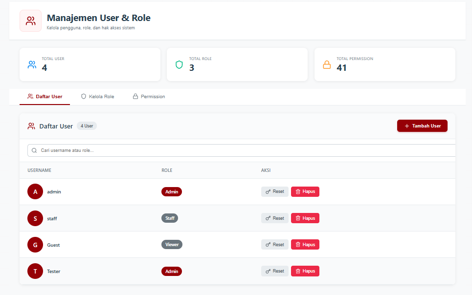
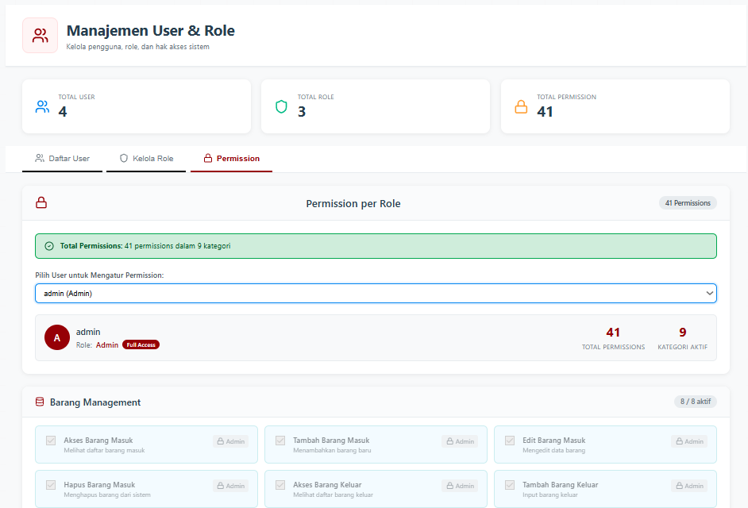
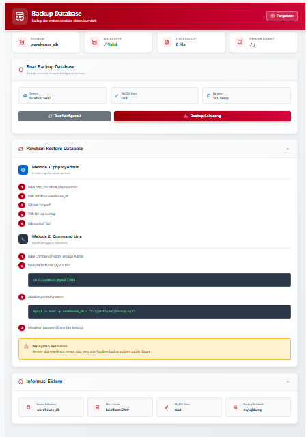

# IT Asset Management System — Si Asset

**Si Asset** is a web-based IT Asset Management System developed during my
6-month internship at PT PLN (Persero) UP3 Bandung.

The system was designed to help manage IT assets, transactions, users,
reports, and system activities through a centralized web application.

---

## 🎯 Project Overview

- **Project:** Si Asset — IT Asset Management System
- **Type:** Full-Stack Web Application
- **Context:** Internship / PKL
- **Organization:** PT PLN (Persero) UP3 Bandung
- **Duration:** July 2025 – December 2025
- **Role:** Full-Stack Developer
- **Frontend:** React.js
- **Backend:** Express.js
- **Database:** MySQL

---

## ✨ Key Features

- 🔐 User authentication & role-based access control (RBAC)
- 📦 IT asset management
- 📥 Asset incoming & outgoing management
- 💻 IT equipment rental management
- 📊 Dashboard & asset statistics
- 📝 Activity & system logging
- 📄 PDF & Excel report export
- 💾 Database backup & restore
- 👥 User & role management
- 🔎 Search, filtering, sorting & pagination

---

## 🛠️ Technology Stack

- React.js
- Express.js
- Node.js
- MySQL

---

## 👨‍💻 My Contribution

During the project, I was responsible for the development of the
application, including:

- Developing the frontend using React.js
- Developing backend APIs using Express.js
- Designing and integrating the MySQL database
- Implementing authentication and RBAC
- Developing asset management modules
- Implementing rental and transaction features
- Developing PDF and Excel export functionality
- Implementing activity and system logging
- Implementing database backup functionality
- Testing, debugging, and integrating the application

---
## 🖼️ Application Preview

Selected screenshots showcasing the main features and interface of the application.

### Dashboard

### Asset Management

### Rental Management

### User Management

### Permission Management

### Database Backup

---

## 📌 Project Context

This project was developed as part of my Praktik Kerja Lapangan (PKL) at PT PLN (Persero) UP3 Bandung.

The application was developed to support IT asset management and was used as part of the internship project.

Source code and internal company data are not publicly distributed.

